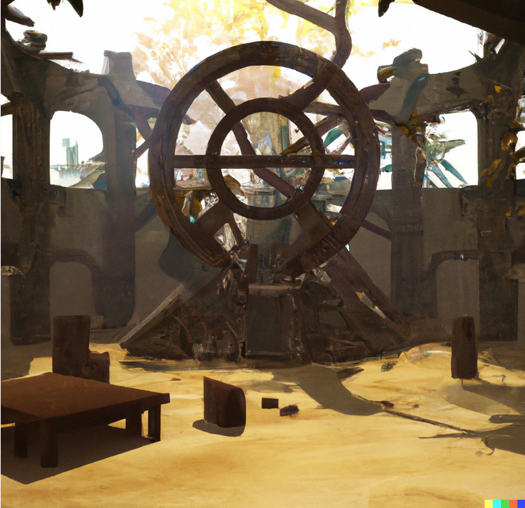
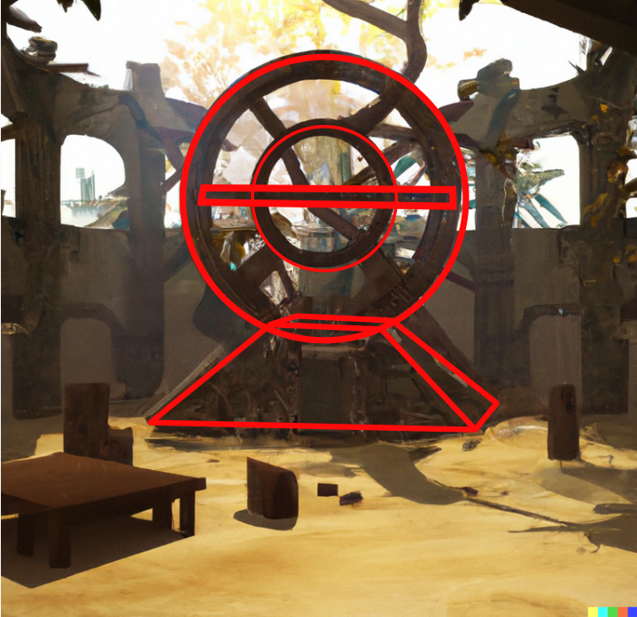
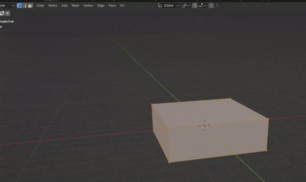
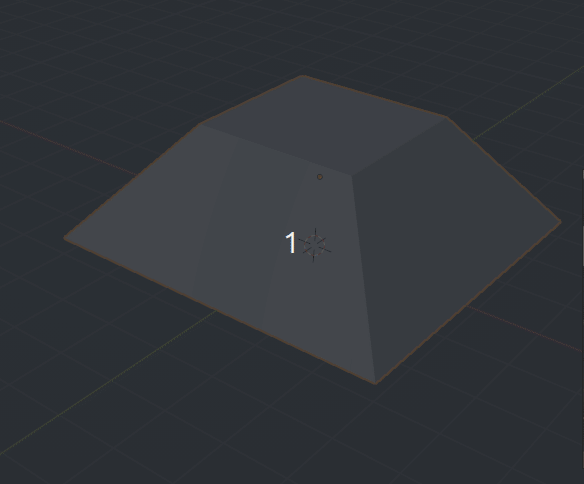
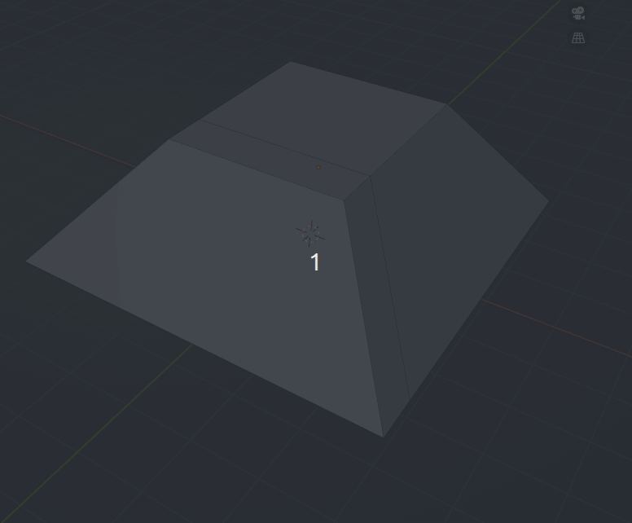
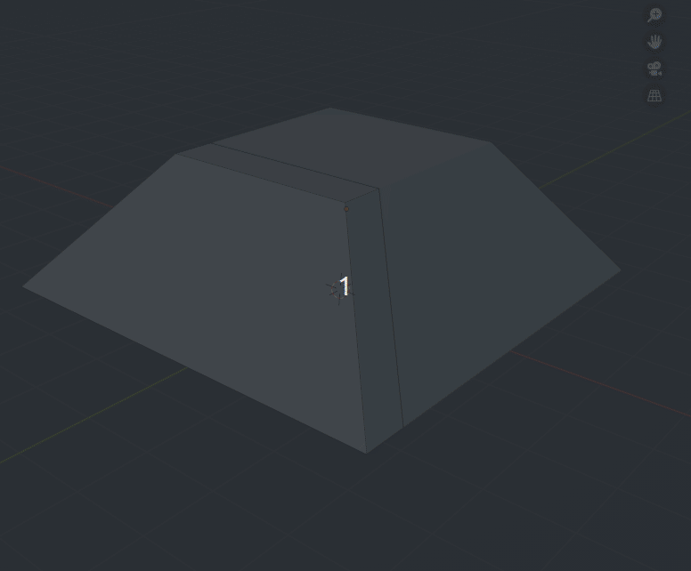
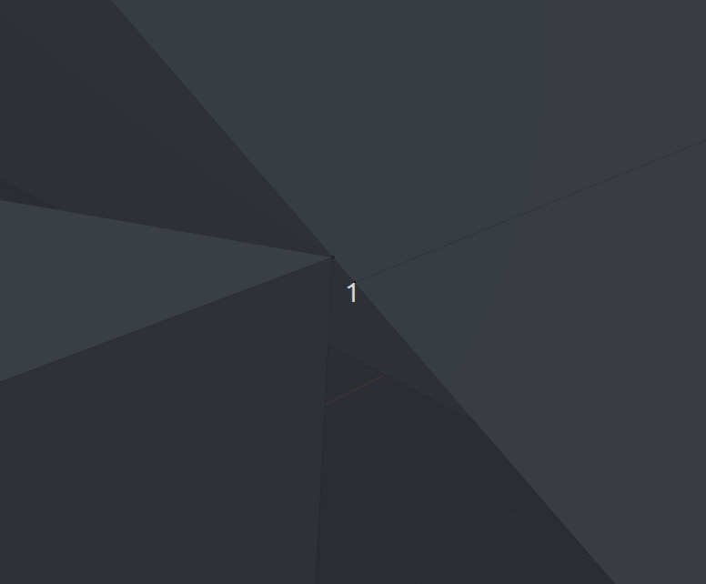
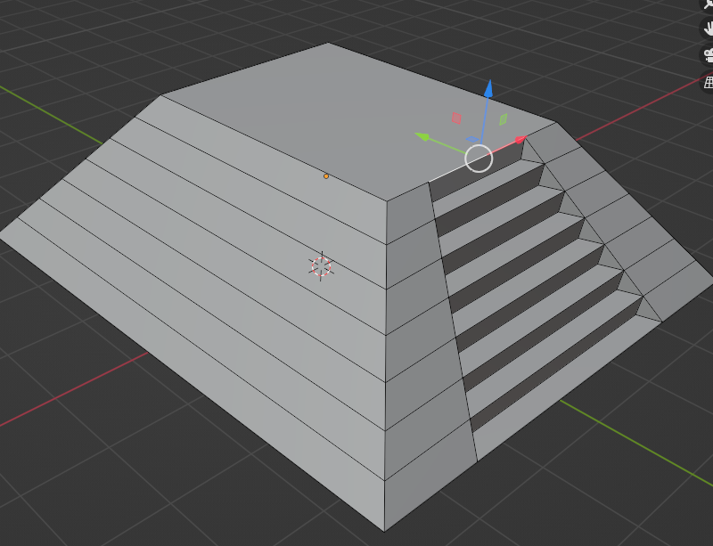
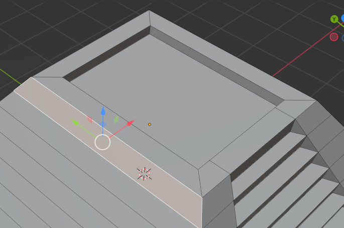

# Començant a modelar amb blocs

## Configuració inicial de Blender

Instal·lar els plugins:

* Mesh: LoopTools

Configurar en System > Undo Steps a 256 per poder tornar enrere fàcilment.

Instal·lem també Pureref per veure per damunt sempre les imatges de referència.

Generalment eliminem la llum i la càmera perquè en aquest cas no la necessitem.

## Detecció de les figures geomètriques bàsiques

En la secció de blocking anem a fer un model que pot servir com a "prop" en un videojoc.
Li he demanat a una IA que genere una ruina futurista i m'ha generat una imatge que pot servir d'inspiració:

Podria ser un portal entre estrelles abandonat per una antiga civilització. La imatge no és molt nítida, però ha servit d'inspiració per fer alguna cosa pareguda amb llibertat per inventar els detalls.

Deguem observar les geometries bàsiques. Per exemple, la part de baix pot ser un tronc de piràmide, la par de dalt són alguns anells connectats per rectangles. En la base es poden intuir unes escales per pujar als anells.

## Modelat del blocs

En aquesta part es tracta de fer les formes geomètriques bàsiques amb pocs polígons. Sempre tractarem de fer polígons de **4 costats**. En un videojoc no podem tindre "n-gons", que són polígons de molts costats. També evitarem els triangles, encara que no passa res. Els triangles "trenquen" la geometria" i fan més difícil manipular les UV, tallar, treure loops...  
Per una altra banda, sempre modelarem a **escala real**. Encara que siga una videojoc, els efectes de llums, textures i partícules estan dissenyats a escala per respectar la física. Al redimensionar qualsevol figura, deguem d'aplicar l'escala per a que estiga sempre a 1 amb **Ctrl+A**.

> Una bona pràctica és fer que el model estiga sobre el cursor i aquest al centre de coordenades. Quan importem en un motor de joc, pot donar menys problemes. 

### El tronc de piràmide

Aquesta és la figura més simple. Després de esborrar tot, afegim un cub amb **Shift+A Mesh > Cube**. En el menú de creació i posteriorment en el menú de ítem, podem aplicar les dimensions aproximades en metres que considerem que té. Suposem que el cercle és de uns 4 metres de diàmetre, així que la base sembla tindre un 2 metres d'alt i uns 6 d'ample.

Recordem aplicar l'escala i entrem al mode Edició amb **Tab**. Ahí seleccionem la cara de dalt pressionant tecla **3** per seleccionar per cares. Una vegada seleccionada, la podem reduir amb **S** per crear la part de dalt del tronc.

Podem jugar amb les dimensions en el mode edició el que necessitem. Per veure cóm queda en vista frontal, podem pressionar **1** en el teclat numèric. Els altres números mostren altres vistes.

Anem a crear les escales. Com que afecten sols a una part, podem extrudir en l'eix Y amb **E, Y** per tindre més polígons en eixe costat. 

Podem llevar les cares de la part de baix del model, ja que no es veuen en el joc.

Per poder modelar l'escala sense afectar a la resta del tronc, podem separar-la amb **P**, eixir del mode edició i tornar a entrar amb l'objecte separat. Més endavant el podem tornar a juntar.

Una vegada en el troç separat en mode edició, podem fer **Ctrl+R** per crear nous "edges" en la geometria, tant en vertical com en horitzontal. El separarem en vertical, separem de nou l'objecte en **P** i Separem el del mig en horitzontal

Amb **Shift+Alt** Seleccionem un bucle sencer de vores. i el podem redimensionar en l'eix X amb **R, X**.

Per fer els escalons, seleccionem totes les línies creades en **Ctrl+R** i apliquem en el botó dret **Bevel Edges**. Després, seleccionem una de cada nova vora creada i la desplacem abaix. Podem anar canviant de vistes per deixar-ho al nostre gust. Després es pot ajustar de nou.

Ara amb **Ctrl+J** Fusionem en mode Objecte totes les geometries. Per anar al detall, podem pressionar **.** En el teclar numèric i s'apropa al vertex seleccionat. Per pegar vertex, entrarem al menú de la tecla **M** després de seleccionar els dos vertex. 

Seleccionant les vores i amb **F** Podem omplir les cares que falten. Es creen triàngles, però no passa res.

Després de varies operacions com les anteriors, he unit totes les cares, vores i vertex. També hem eliminat vores innecessàries o creat les que calen per millorar la geometria. Amb **Supr** i **Disolve Edges** eliminem els que vulguem sense eliminar les cares.
En la captura encara queda una cara problemàtica, ja que la de dalt té més de 4 vores. Ja l'arreglarem. 

Amb la tecla **I** podem insertar una cara i amb **E** Extrusionar per crear un forat en la part de dalt:

