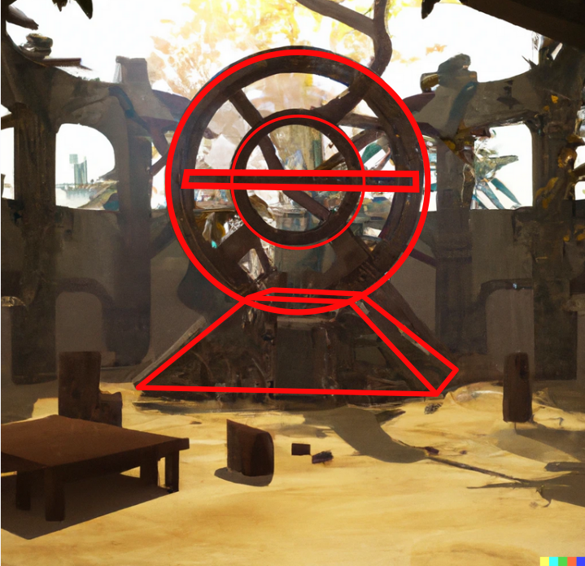
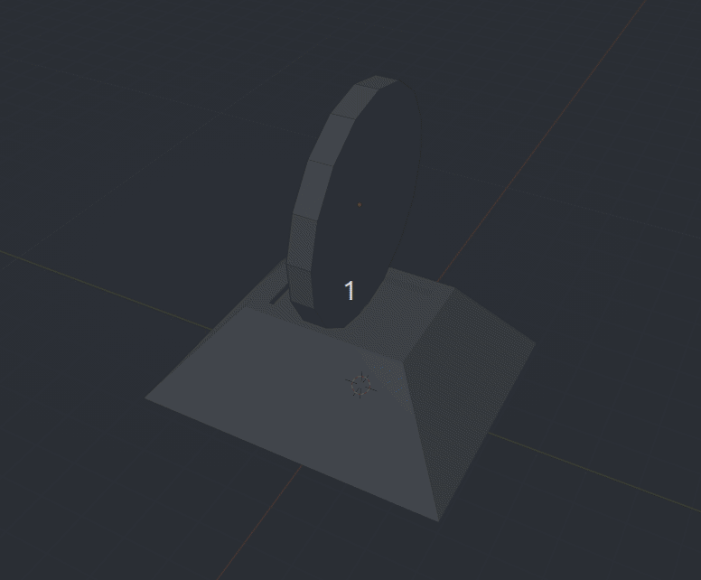
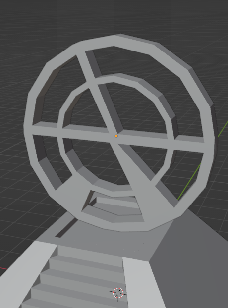

# Blocs 2

Recordem L'anterior document en el que Decidíem que la part de dalt serien Cilindres i Rectangles. 

Al crear un cilindre és important decidir les vores que va a tindre. Blender ens dona 32 per defecte, però és massa per a un joc. Així que abans de fer res, en el menú de creació, li indicarem que 16 cares.

**Mayus+A Mesh > Cilinder**, triar 16 edges. Després rotar 90 graus amb **R, X, 90** i desplaçar amb **G Z**. El cilindre té uns 4 metres de diàmetre. Li donem les dimensions i apliquem l'escala amb **Ctrl+A**. També pot ser útil **Botó dret > Set Origin > Origin to Geometry**.

La geometria d'un cilindre és problemàtica per a jocs perquè té una cara amb 16 vores. En aquest cas no será un problema, perquè al fer el toroide es crearan cares de 4 vores.

Per crear el toroide podem seleccionar les cares, **I**, eliminar les cares del centre i reconstruir les cares interiors amb **F**.

També podríem haver crear una circunferencia 2D i extrusionar. 

Podem duplicar el toroide amb **Ctrl+D** i redimensionar. 

A continuació anem a crear els rectangles. No són regulars i no tenen perquè estar separats dels cilindres, així que unint vores els poden crear

Després de crear totes les cares per al rectangles, el modelat en blocs bàsic està completat. En aquest cas no cal cap rectificació de geometria

