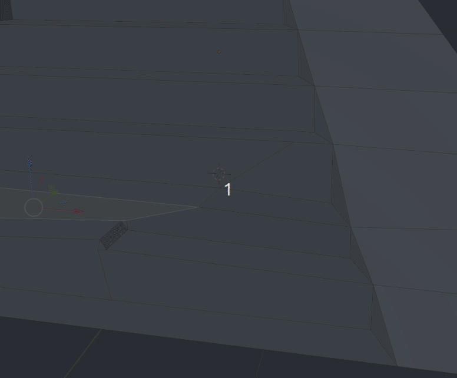
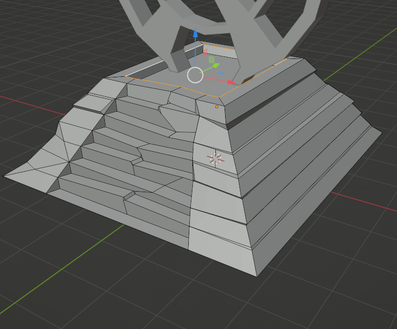

# Tallar Blocs

Fins al moment hem fet geometries exactes i rectes. Però anem a simular imperfeccions pel desgast del temps. 
Per a aconseguir-ho, anem a utilitzar la ferramenta del ganivet **K**. Això pot generar n-gons que tindrem que solucionar.

Amb extrusions sobre la normal (botó dret) i tractament individual de vertex i vores, creant noves cares amb **F** i amb **K** Farem més imperfeccions. També s'han crear bevels per suavitzar els trencaments. 

Seleccionant el **Proporcional Editing** Ens permet moure un vertex o un grup i afectar als dels voltants. El tenim disponible en la part de dalt de la interfície. 