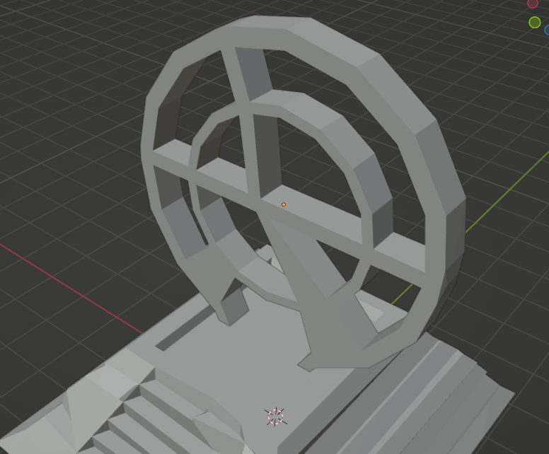
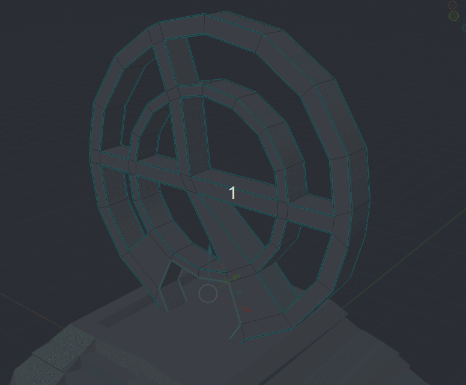

# Auto Smooth

Per suavitzar les superfícies encara que tinguen pocs polígons es pot utilitzar Shade Smooth.

Amb **Botó Dret > Shade Smooth** podem convertir el portal en suavitzat. Però queda massa:

Per a que no quede tan suavitzat, hem marcat tots els angles rectes amv **Mark Sharp** i Hem activat **Auto Smooth** En el menú d'**object Properties > Normals**. Ahí podem ajustar l'angle màxim que aplica Smooth.

A partir de Blender 3.6 es pot activar **Auto Smooth** dirèctament amb el botó dret. 

