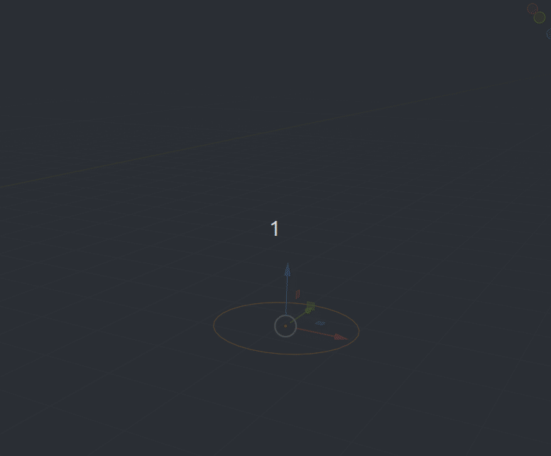
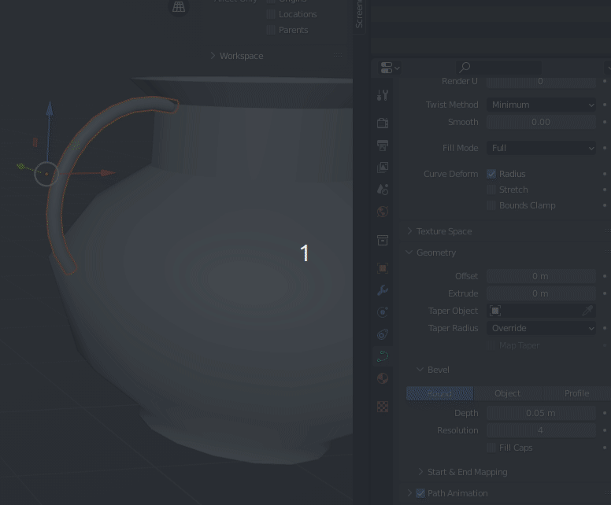

# Objectes 2D

Blender permet començar a treballar en primitives 2D per després extruir i transformar a 3D. 

Per demostrar cóm podem treballar en ells, anem a fer una jarra de fang.

Ací sols hem creat una circunferencia i en mode edició anem fen extrusions i redimensionant.

Després d'acabar de modelar i aplicar **Smooth** Ens donem compte de que 32 són massa cares per al cilindre, així que poden seleccionar i disoldre les vores:

La part de baix de la jarra la podem juntar seleccionant totes les vores i **M At center**

## Curves Beizer

Per fer el maneg de la jarra utilitzem una curva Beizer, la redimensionem, girem i adaptem a la forma desitjada.  

Li donem Bevel al Beizer per donar-li volum.

El podem convertir en polígon amb **Botó Dret > Convert To > Mesh**

El podem unir a la resta de la jarra amb **Ctrl+J**. 

També podem reduir la geometria disolent vores. 

Tot el que sobra per dins de la jara ho podem unir als vertex de la jarra. 

## Donar Volum

La jarra no está tancada ni per dalt ni per baix. Si en el joc no es va a veure per baix, no cal acabar-la. Però cal donar-li volum.

Per donar Volum, Apliquem el modificador **Solidify**. 

