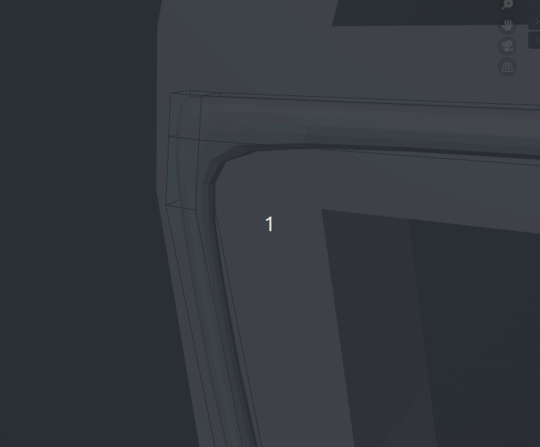

# Subdivisions

En la imatge original es pot intuir certs elements tecnològics a la zona circular, com cables o tubs. 

Hi ha varies maneres de fer tubs en Blender. Podem unir cilindres o anar extruint un cilindre original fent les curves. 

El el nostre cas anem a practicar amb les subdivisions. Farem un cub i anirem extruint i tallant amb **Crtl+R** fins traçar tota la forma del tub. 

En els modificadors, adefgim el de **Subdivision**. El resultat inicial es sembla a un tub, però les juntes no queden realistes. Per millorar el resultat, podem afegir loops de contenció amb **Crtl-R** I apropar-los a les juntes per forçar angles més rectes.

Al fer el cilindre del portal li vam donar 16 cares, com que és molt gran, les cares es veuen massa rectes. Anem a utilitzar la subdivisió per millorar l'aspecte. El podem afegir amb **Ctrl+1**. Amés, afegim loops de contenció per no suavitzar les vores "dures".

Quan estem conformes amb el modificador el podem **aplicar**.

