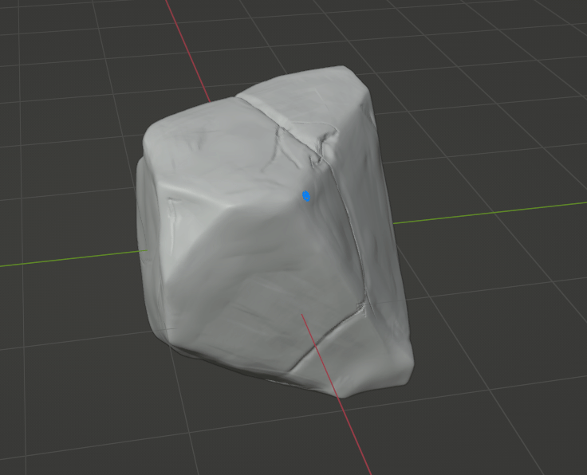

# Esculpit

Amb **Ctrl+Tab** obri un menú on poden accedir a ferramentes d'esculpir. Aquestes afecten als vertex.

Les ferramentes d'esculpit tenen opcions accesibles amb el click dret com el radi o força de la ferramenta. El radi també és accesible amb **F** i la força amb **Shift+F**. 

Amb **Mayus+Click** Suavitza l'efecte de la ferramenta. Amb **Ctrl+Click** es fa l'efecte contrari. 

Es tracta de practicar molt el totes les ferramentes per agafar soltura. Els objectes amb moltes cares i sense ngons tenen més llibertat de moviments a canvi de pitjor rendiment posterior.

> En el modelat High Poly és on s'aplica més l'escultura.

En línies generals, les ferramentes blaves permeten un modelat similar al fet a mà. Les ferramentes grogues solen provocar canvis més radicals i canvis en la topología. Les ferramentes roges són per a suavitzar, llevar imperfeccions o omplir forats. 

Si observem durant el modelat, en general no s'afegeix geometria. La podem afegir amb **Ctrl+R** i prèviament podem configurar la mida dels quadres amb **R**. Aquesta geomeria afegida intenta no deformar l'objecte original, al contrari del que fa el modificador de **Subdivision Surface**. 

Un bon començament por ser amb un objecte que no necessite una forma molt compleza però que tinga un aspecte "natural". Per exemple, podem modelar una pedra. 

Podem comenzar per un poliedre irregular creat eliminant puntes a un cub. Després apliquem més textura i anem afegint imperfeccions sense perdre la forma com de roca trencada. Amb les ferramentes de **Clay** i **Crease** Podem fer les grietes i imperfeccions en la roca. Podem anar suavitzant els excessos de les ferramentes i aplicant **Multiplan Scrape** quan les aristes s'allisen massa. 

Finalment, amb **Ctrl+R** Repamejarem la malla per evitar triangles forçats. 

