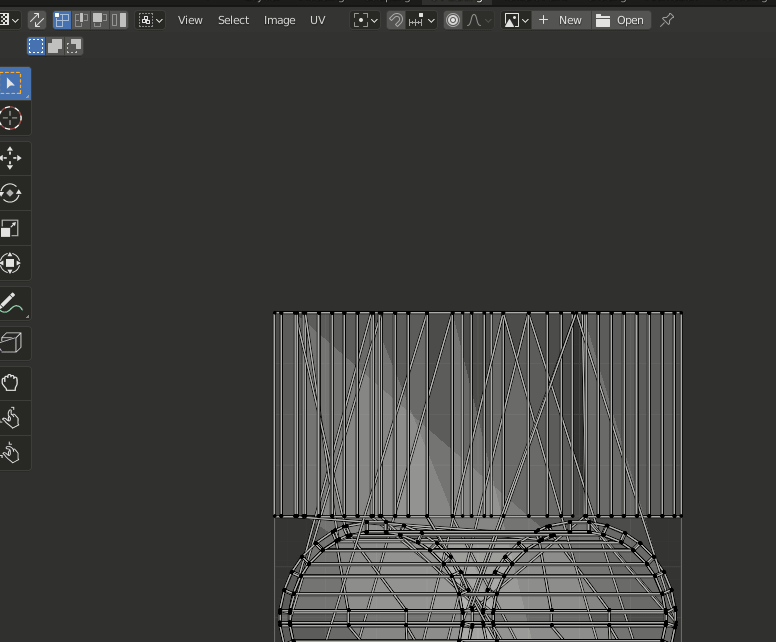
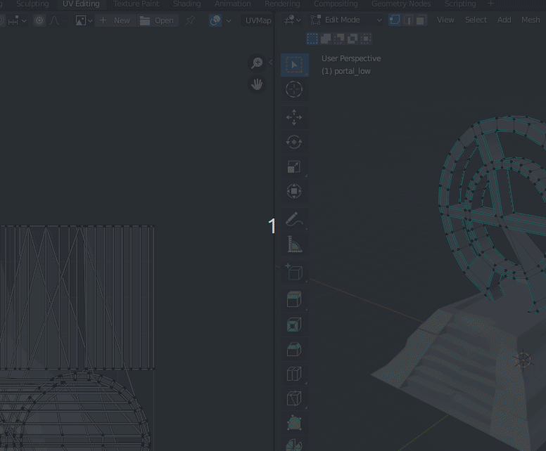
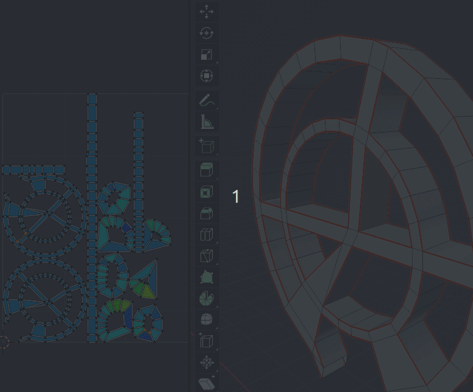

# Realització del UVS

Guarden un arxiu nou per començar a treballar els UVS.

Entrem en UV Editing. Aquesta interfície permet descomposar un objecte en figures planes a les que aplicar una textura. 

Habilitem la opció **UV Sync Selection** i **UV > Live Unwrap** i en el mode edició, també triem **Option > Live Unwrap**. Això permet sincronitzar els talls del mode edició amb l'unwrap.

També habilitem **Display Strech** i per **Area**.

Els tons Blaus tenen bona geometria, els grocs tenen stress en els UVs.

Els objectes complexos tenen molts problemes per a desplegar-se en 2D. Per això, cal indicar per on volem el tall. En el mode edició, triem les vores i **Botó drest > Mark Seam**. Veurem cóm tenen menys stress.

Podem ajustar després la posició dels desplegats per a que no estiguen massa junts i aprofitar l'espai.

La decisió de per on tallar es basa en la idea que tenim per a crear la textura després. No deuriem tallar per una part molt visible o per on el canvi de textura por ser molt evident, com cares planes. Al tallar també estem decidint que hi ha un tall de temàtica en la textura. En aquest moment ens adonem de la importància de tindre malles netes i amb poques triangulacions.

Els objectes llargs com els tubs s'ha de tallar al llarg i per la meitat si cal.
