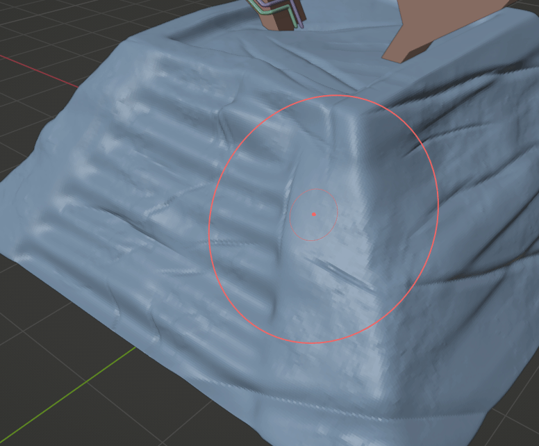
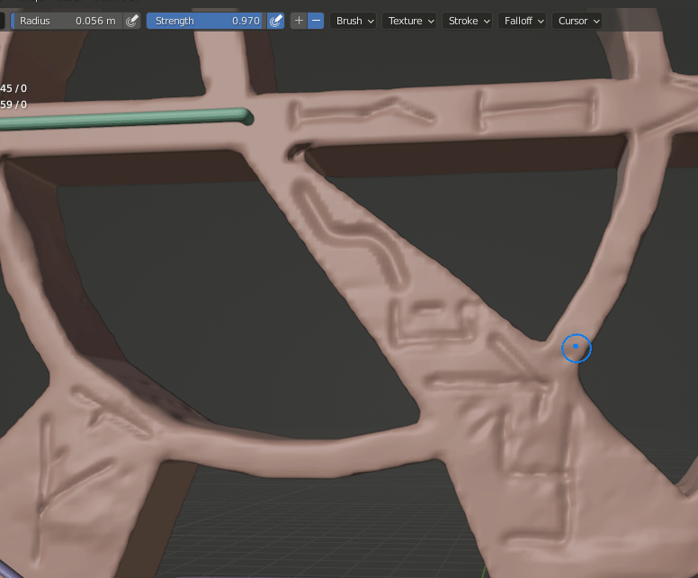

# Configuracions per a High Poly

Amb el model en baixa, guardem una copia. Una vegada en la copia, dupliquem la col·lecció de tots els objectes en baixa i anomenem a l'altre grup com "high poly" o similar. També canviem el nom de cada objecte.

Ocultem el grup de "low" per a tindrer-lo com a referència.

Per al High és important que les malles estiguen tancades, així que les tanquem seleccionant les vores i pressionant **F**.

Per al modelat en alta podem utilitzar pinzells de tercers, en aquest cas, els instal·lem.

Els objectes, per a ser esculpits, necessiten molts polígons. Amb subdivisions el problema és que suavitza la geometría. En el mode esculpit, podem fer **Mayus+R** per a afegir més malla. Ahí podem triar la densitat i aplicar amb **Ctrl+R**. La densitat pot ser de 0.02mm, per exemple. El resultat eixirà un poc facetat, però es pot suavitzar amb **Mayus+Click**. Això llevarà detall, però es pot arreglar després. Després de suavitzar, podem aplicar de nou **Ctrl+R** y torna a aplicar la malla.

Amb el pinzells per defecte o el pack https://stylizedstation.gumroad.com/l/zMJlJ, per exemple, podem anar esculpint les imperfeccions. En general, es pot començar pel suavitzat i després anar donant forma i tornant a afilar el que s'ha perdut en el suavitzat.

Passem a mode objecte, guardem i activem el "low poly". Han d'estar en la mateixa posició i es veuran mesclats.

Aquest és el moment de seleccionar el Low i aplicar el modificador ShrinkWrap amb el target del High. Això ajusta la malla del Low al High per a pode aplicar millor les textures posteriorment.

En el exemple es veuen les escales molt desfasades respecte al High. Això es soluciona aplicant **Ctrl+R** en mode edició o K i tornant a netejar els polígons del Low.

Quan s'han fet moltes modificacions profundes a la malla esculpint, es torna a aplicar **Ctrl+R** Per refer la malla i evitar geometries estranyes. Després tal vegada cal tornar a suavitzar.

Si necessitem fer formes rectes o més regulars al esculpir, podem activar **Stroke > Stabilice Stroke**. Vaig a utilitzar aquesta tècnica per esculpir runes antigues en el portal.

Després de esculpir tots els objectes, li creem un nou material amb el mateix nom a cadascun, tant en el low com el high.

> Revisarem també que les UVs aplicades en Low Poly estiguen correctes en la versió High a pesar d'afegir més malla. 