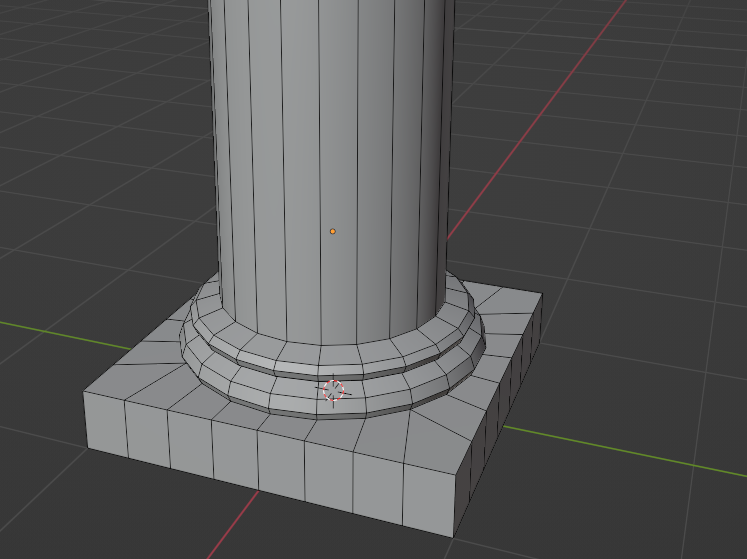

# Columna dórica

Es tracta de practicar amb les simetries i el mode edició. 

Farem un cub, que anirem extrudint fins tindre la forma bàsica:
Podem fer també un cilindre i el cub desprès o fer un cub i fer-li 8 talls per cada costat per tindre 16 estries.

> He utilitzat LoopTools > Circle per fer el cercle dins del quadrat.

Ara tallem de forma simètrica en totes les dimensions per aplicar el modificador **Mirror**.

Per poder fer mirror en la Z tenim que situar el seu origen dalt del tot del fragment de columna. Ens podem ajudar d'un objecte buit per moure l'origen 3D i després el de l'objecte.

Després fem l'extrusió i netegem la malla si cal. 

Apliquem un tall i bevel al tall per crear la curva de baix. Tal vegada cal fer el bevel a mà en l'estria partida.

